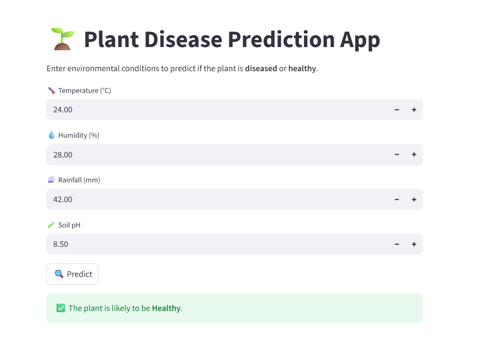

# 🌱 Plant Disease Prediction using Machine Learning


Python | Machine Learning | Streamlit | Scikit-learn

This project predicts whether a plant is **healthy or diseased** based on environmental conditions such as temperature, humidity, rainfall, and soil pH.
A machine learning model is trained on plant data and deployed using a **Streamlit web application** for real-time predictions.

---

## 🌐 Live Application

🚀 **Try the Live App:**  
👉 https://plant-disease-prediction123.streamlit.app/

---

## 🚀 Features

* Machine Learning based prediction
* Simple and interactive **Streamlit web interface**
* Real-time disease prediction
* Easy to run locally

---

## 📊 Input Parameters

The model uses the following environmental conditions:

* 🌡️ **Temperature (°C)**
* 💧 **Humidity (%)**
* 🌧️ **Rainfall (mm)**
* 🧪 **Soil pH**

Based on these inputs, the model predicts whether the plant is:

* ✅ **Healthy**
* 🚨 **Diseased**

---

## 🛠️ Tech Stack

* **Python**
* **Pandas**
* **NumPy**
* **Scikit-learn**
* **Streamlit**

---

## 📊 Dataset

The dataset used in this project contains environmental conditions affecting plant health, including:

- Temperature
- Humidity
- Rainfall
- Soil pH

The model was trained using this dataset to classify plants as **Healthy** or **Diseased**.

---

## 📂 Project Structure

```
Plant-Disease-Prediction
│
├── app.py                       # Streamlit web application
├── model.ipynb                  # Model training notebook
├── plant_disease_dataset.csv    # Dataset used for training
├── plant_disease_model.pkl      # Saved trained model
├── requirements.txt             # Required Python libraries
└── README.md
```

---

## ⚙️ Installation & Setup

### 1️⃣ Clone the repository

```
git clone https://github.com/somyasinghal0/Plant-Disease-Prediction.git
```

### 2️⃣ Navigate to the project folder

```
cd Plant-Disease-Prediction
```

### 3️⃣ Install required libraries

```
pip install -r requirements.txt
```

### 4️⃣ Run the Streamlit app

```
streamlit run app.py
```

---

## 📸 Application Interface

The Streamlit application allows users to enter environmental parameters and get instant predictions about plant health.


---

## 🎯 Future Improvements

* Add more plant disease datasets
* Improve model accuracy
* Add disease probability score
* Improve UI/UX of the application
* Add more environmental parameters
* Add image-based disease detection

---

## 👩‍💻 Author

**Somya Singhal**

GitHub: https://github.com/somyasinghal0  
LinkedIn: https://www.linkedin.com/in/somya-singhal123/

---
